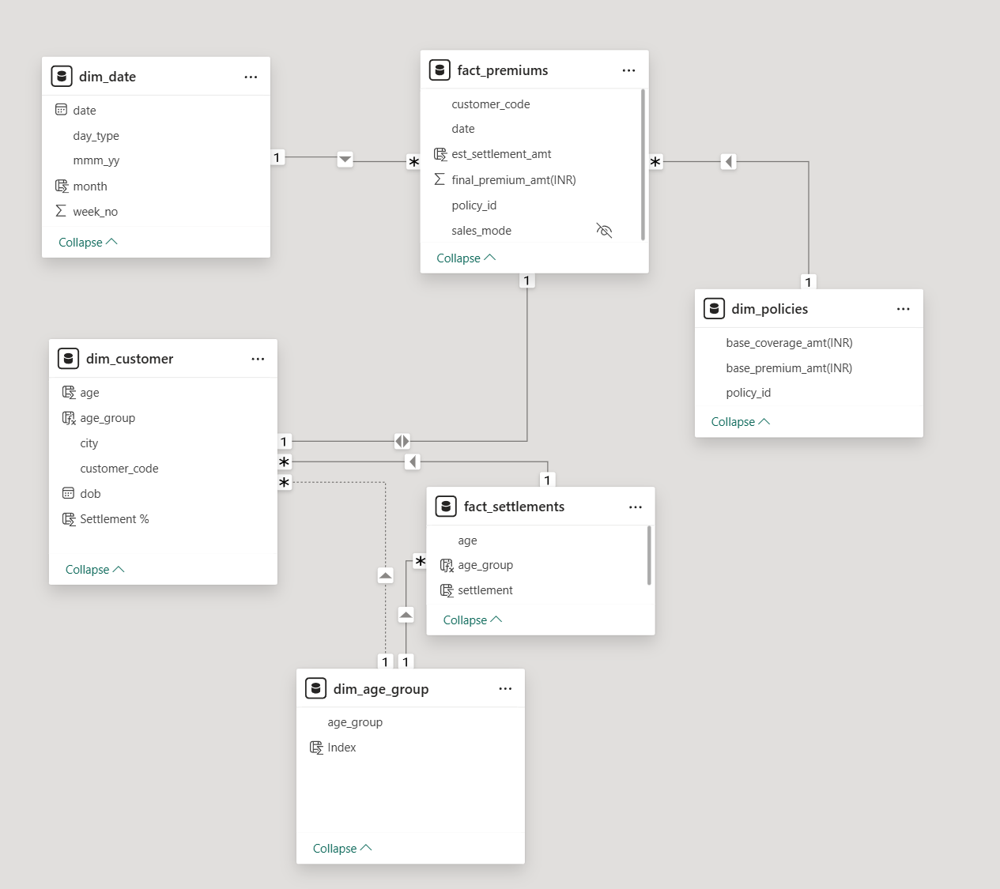

# ShieldInsurance_PowerBI

### Project Goal
Analyse Shield Insurance's performance using Power BI, uncovering key insights to optimize investment strategies. This project focused on analyzing investment trends and policy performance across major cities, including Delhi, Chennai, Mumbai, Indore, and Ahmedabad.

### Data:
We have insurance data spanning six months, from November 2022 to April 2023, for various policies covering customers aged 19 to 75+ across five different cities.

### Data Model

## Stake Holder Request:
- Show total customers, total revenue, daily revenue growth, daily customer growth as key metrics
- Month over month change% on key metrics
- Segment customers based on their age groups: 18-24, 25-30, 31-40, 41-50, 51-65, and 65+.
- Total revenue split by age group, city, Total customers split by age group, city
- Filters on sale mode, age group, city, month, policy ID
- Separate page for sales mode analysis
- Total customers split percentage by sales mode
- Total revenue split percentage by sales mode
- Separate page for age group analysis
- Age group vs expected settlement
- Age group vs policy preference
- Age group vs sales mode

## PowerBI Dashboard:

 ### Home Page

 ### Overall Analysis

### Age Group Analysis

### Sales Mode Analysis

